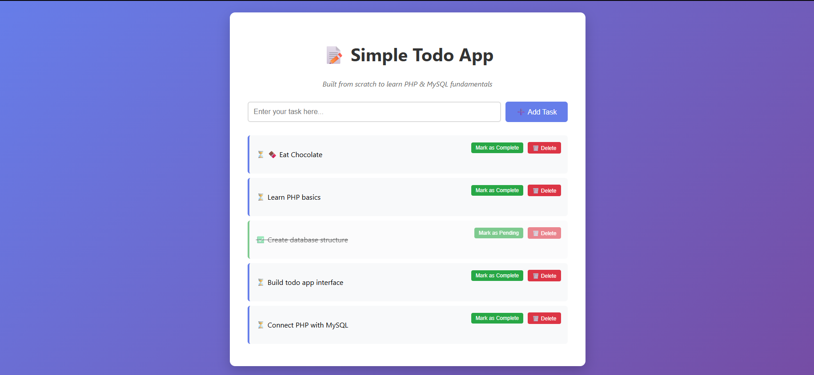
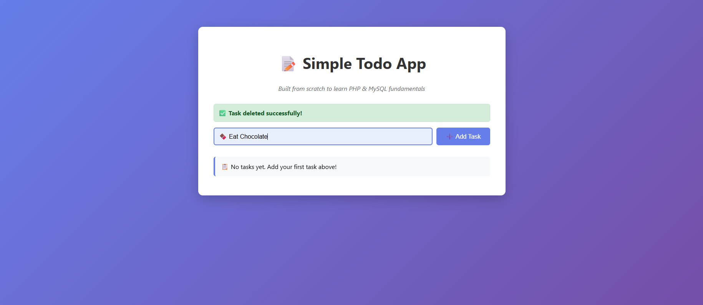
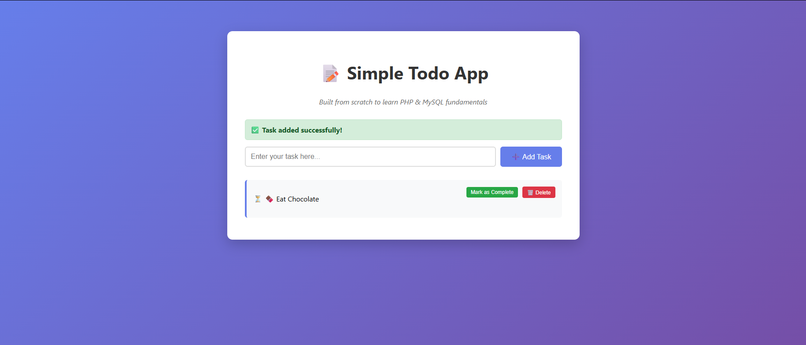

# Simple Todo App

A basic Todo application built from scratch to learn PHP and MySQL fundamentals.

## 📸 Screenshots

### Main Interface



### Adding New Tasks



### Task Management



### User Authentication System

#### User Registration


#### User Login


#### Login Success


## 🎯 Features

- ✅ Add new tasks
- ✅ Mark tasks as completed/pending
- ✅ Delete tasks
- ✅ Persistent data storage with MySQL
- ✅ Clean and responsive design
- ✅ User registration and authentication
- ✅ Secure password hashing
- ✅ Form validation and error handling

## 🛠️ Technologies Used

- **Frontend:** HTML5, CSS3
- **Backend:** PHP 8+ with PDO
- **Database:** MySQL with relational design
- **Security:** Password hashing, prepared statements
- **Server:** XAMPP (Apache + MySQL)

## 📋 Requirements

- XAMPP (or similar LAMP/WAMP stack)
- PHP 8.0+
- MySQL 5.7+
- Web browser

## 🚀 Installation

1. **Clone the repository:**

   ```bash
   git clone https://github.com/yourusername/simple-todo-app.git
   ```

2. **Move to XAMPP htdocs:**

   ```bash
   cp -r simple-todo-app /xampp/htdocs/
   ```

3. **Start XAMPP services:**

   - Start Apache
   - Start MySQL

4. **Create database:**

   - Open phpMyAdmin: `http://localhost/phpmyadmin`
   - Run the SQL script from `database_setup.sql`

5. **Access the application:**
   ```
   http://localhost/simple-todo-app
   ```

## 📁 Project Structure

```
simple-todo-app/
├── index.php              # Main todo application
├── login.php              # User login page
├── register.php           # User registration page
├── config.php             # Database configuration
├── database_setup.sql     # Database creation script
├── test_connection.php    # Connection test file
├── ROADMAP.md             # 21-day development plan
├── screenshots/           # Application screenshots
└── README.md              # Project documentation
```

└── README.md # Project documentation

````

## 🎓 Learning Journey

This project was built step by step to understand:

- Database design and table creation
- PHP-MySQL connection with PDO
- CRUD operations (Create, Read, Update, Delete)
- Form handling and data validation
- Prepared statements for security
- Error handling with try/catch
- User authentication and session management
- Password hashing and security best practices
- Foreign key relationships

## 📈 Development Progress

### ✅ Completed (Days 1-2)
- Basic todo functionality with CRUD operations
- User registration and login system
- Database design with relational structure
- Secure password handling
- Form validation and error handling
- Professional UI/UX design

### 🎯 Next Steps (Following 21-day roadmap)
- Session management and user-specific tasks
- Enhanced task features (categories, due dates)
- REST API development
- Modern framework implementation (Laravel)
- Frontend development (React)
- DevOps and production deployment

See [ROADMAP.md](ROADMAP.md) for the complete development plan.

## 🔧 Configuration

Update `config.php` with your database credentials:

```php
define('DB_SERVER', 'localhost');
define('DB_USERNAME', 'root');
define('DB_PASSWORD', '');
define('DB_DATABASE', 'simple_todo');
````

## 🤝 Contributing

This is a learning project, but feel free to:

- Report bugs
- Suggest improvements
- Fork and experiment

## 📝 License

This project is open source and available under the [MIT License](LICENSE).

---

**Built with ❤️ for learning PHP & MySQL**
